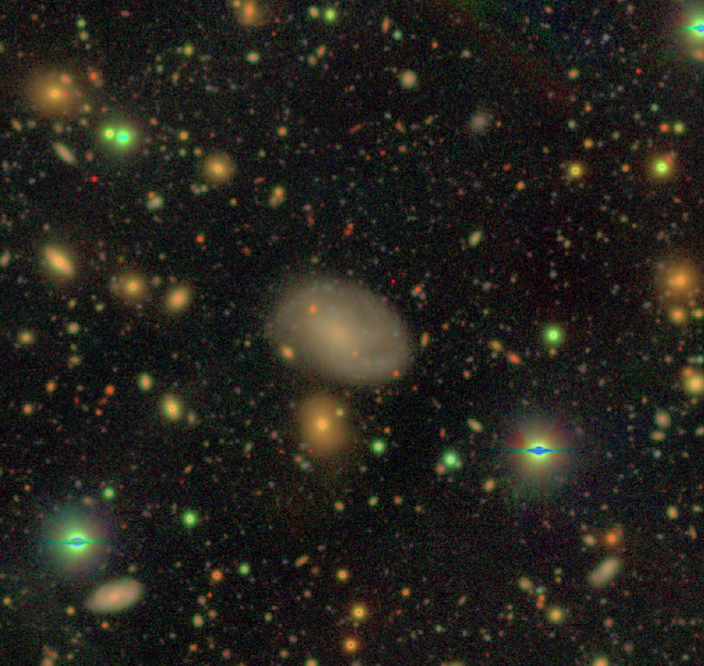

# Senbon-Zakura (千本桜)

----

Crazy idea about statistical study of extragalactic globular clusters using HSC data

How many of those lovely red dots on HSC images around nearby galaxies are globular clusters?

